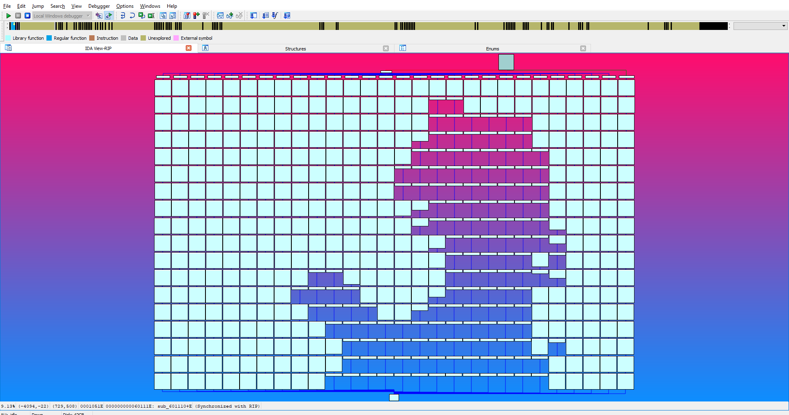

# Bad Apple on IDA



Writing a program that modifies itself in runtime to play Bad Apple using it's control flow graph. See the [full video here](https://www.youtube.com/watch?v=Tvmj6hOny8w)!

## Okay Why?

Wrong question. It's why not?

## How it's done

### Displaying the Screen

All the hardwork for how to display basic blocks in IDA such that it aligns as a nice grid is done by [REpsych by xoreaxeaxeax](https://github.com/xoreaxeaxeax/REpsych). Do check him out he has some awesome stuff!

But basically, each column is a case in a jump table, which IDA loves to align. Each _pixel_ is a basic block with a really really long instruction `vfmaddsub132ps xmm0, xmm1, xmmword ptr cs:[edi+esi*4+<some const>]` to maintain the block's width, and its height, aka brightness, is controlled via the number of `nop`s in the block.

A block hence looks something like this:

```asm
vfmaddsub132ps xmm0, xmm1, xmmword ptr cs:[edi+esi*4+<smth-readable>]
nop
nop
nop
...
nop
nop
nop
jmp next_block
```

Furthermore, at the first ever block (before the jump table), there's an `int 3` instruction that breaks the debugger (to signify a frame), and instructions that zero out `edi`, `esi` and `eax`. Control flow through the image hence goes to the first case/column, and executes without error.

I essentially rewrote the displaying parts of _REpsych_ in _C_ because I have (unfounded) personal grudges towards _nasm_.

### Changing Pixel Brightness

Right so apparently if IDA detects a bunch of `0xCC` bytes, it won't disassemble it by default. I'm guessing it's because `0xCC` is often used for padding? Meh didn't bother to look that up.

ANYWAYS, to change a pixel brightness, we just have to make the basic block smaller by removing a number of `nop`s. Then we have to patch the `jmp` to properly jump to the next block. To stop IDA from displaying anything other than the new pixel, the rest of the space is filled with `0xCC`. This is fairly easy to do in code.

```C
// In image_utils.cpp
size_t loc = pixel_start + PIXEL_SIZE * (x * HEIGHT + y) + LONG_INST_SIZE;

for (int j = 0; j < PIXEL_SIZE - LONG_INST_SIZE; ++j)
    ((char*)(loc + j))[0] = 0xCC;
for (int j = 0; j < val; ++j)
    ((char*)(loc + j))[0] = 0x90;

int addr = old_jmps[x][y];
((char*)loc + val)[0] = 0xE9;
((size_t*)(loc + val + 1))[0] = addr + BLOCK_SIZE - val;
```

### Displaying the next Frame

Well, just change all the pixels you need and call the `image` function to trigger the breakpoint again.

```C
// In main.cpp
for (int j = 0; j < n_frames; ++j) {
    next_frame();
    image();
}
```

### Playing Bad Apple

I think I spent more time writing the script to capture every frame on IDA than on the actual binary. 

The problem is that IDA is _not_ meant to deal with self modifying code. After modifying the image, the graph is completely messed up. I haven't found an easier solution but to capture each frame, I had IDA run until it reaches the `int 3` instruction, and then I reanalyse _the entire program_ to refresh the graph view properly.

There's _probably_ a better solution for this but I didn't look that hard. I'm not gonna sit in front of my screen repeating that for every frame (3284 times!) so I wrote a [script](./RPA/rpa.py).

Anyways the script ran for 13 hours, reanalysing my poor binary 3284 times.

## Recreating the Video

If you are deranged enough to use this repository you're in the right section. I made almost no effort in making this portable. This is one time use code.

### Building `BadApple.exe`

Navigate to [./BadApple/gen/](./BadApple/gen/) and run `python gen.py`. The script will helpfully ask for the height and width of the screen you want, and the video file. The script halfs the frames of the video file for the sake of sanity. In my [video](https://www.youtube.com/watch?v=Tvmj6hOny8w) I used `27, 18, ./rsrc/BadApple.mp4`. This will generate the files [image.cpp](./BadApple/gen/image.cpp), [movie.cpp](./BadApple/gen/image.cpp) and [image.h](./BadApple/gen/image.cpp).

Then go ahead and open [BadApple.sln](./BadApple.sln) in Visual Studio 2017 (you can probably retarget but I didn't test it).

Then build in, **VERY IMPORTANT**, `x86 Release/Debug`.

### Creating the Video

Open `BadApple.exe` in IDA and run it. IDA will say it hit a breakpoint. Remove that message, clean up your screen and whatever, and run [rpa.py](./RPA/rpa.py). (Extremely fragile script, use with discretion).

This should populate the folder [RPA/out](./RPA/out) with Bad Apple frames in _only_ a matter of a few hours.

Next run [combine.py](./RPA/combine.py) to generate the final video. (Alse An Extremely Fragile Script. The MIT License does not hold me liable to any damage caused from using my scripts).

## Credits Due

First off, [xoreaxeaxeax](https://github.com/xoreaxeaxeax/REpsych) for the absolute genius idea of drawing pictures on IDA.

AND the TouHou community for the [original Bad Apple video](https://www.youtube.com/watch?v=FtutLA63Cp8)

## Bye

Cheers!

